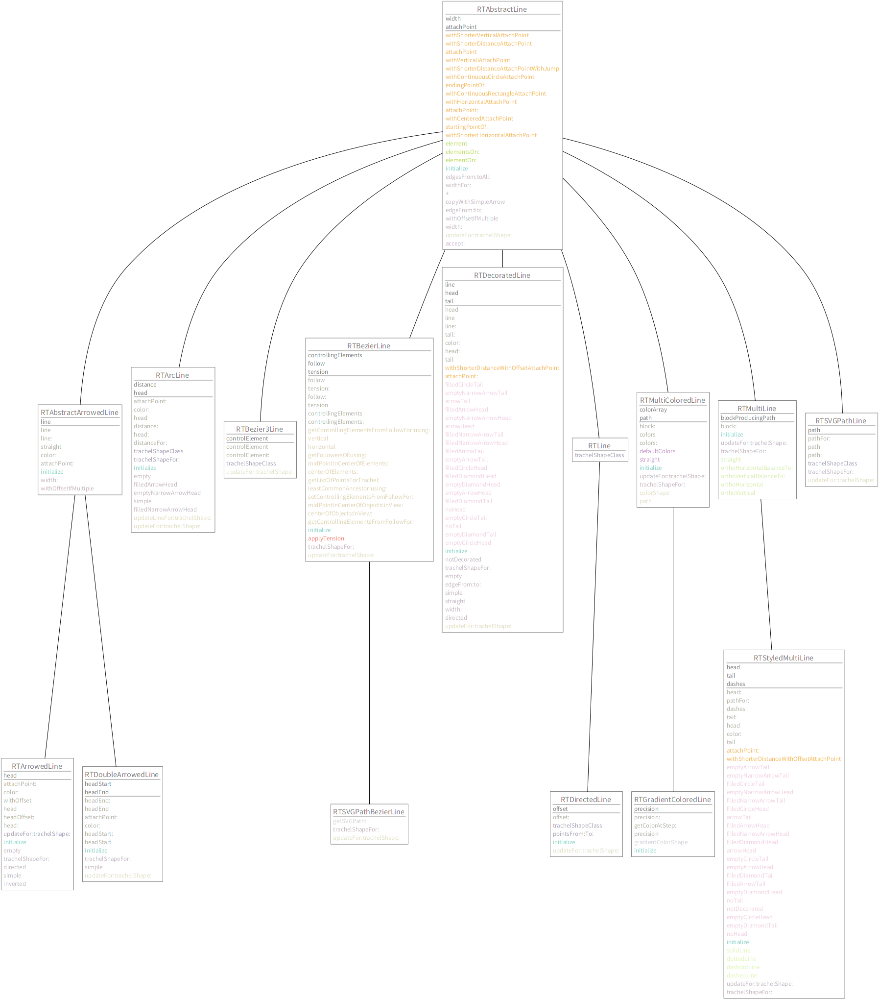

# GraphViz layout

Layout for [Roassal](http://agilevisualization.com/) using [GraphViz](http://www.graphviz.org/).

## Example

```st
someClasses := RTAbstractLine withAllSubclasses.
allMethodCategories := (someClasses flatCollect: #protocols) asSet asArray.
b := RTUMLClassBuilder new.
b lineShape line.
b lineShape color: Color black.
n := RTMultiLinearColorForIdentity new objects: allMethodCategories.
b methodShape color: [ :m | n rtValue: m protocol ].
b methodsNames: [ :cls | cls rtmethods sortedAs: #protocol ].
b addObjects: someClasses.

b layout graphVizDot.

b.
```



See class-side of `RTGraphVizLayout` for more examples.

## Docs

```st
RTGraphVizLayout new
	timeout: aNumberOfSeconds;
	orthogonalLines;
	on: elements directed: directedEdges undirected: undirectedEdges
```

* `timeout` - large and complex graphs may take dot long time to process; you can cap it (default 10 seconds)
* `orthogonalLines` - draw lines orthogonally

* `elements` - nodes that should be positioned; their size will be fixed (dot won't change their size)
* `directedEdges` - edges that should adhere to the same dot ordering direction (e.g.: top->bottom)
* `undirectedEdges` - edges whose direction is not relevant
